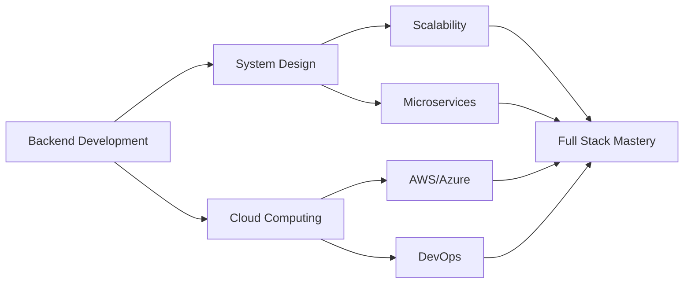

# 👋 Welcome to My Digital Space

<!-- Elegant Header -->

<!-- Professional Typing Animation -->

  

 
 

## 📖 About Me

Hello! I'm **Mohammed Syfudeen S**, a dedicated software developer with a passion for creating elegant solutions to complex problems. My journey in technology is driven by curiosity and a commitment to continuous learning.

### 🎯 Current Focus
- 🔹 Deepening expertise in **Django** and **React**
- 🔹 Exploring **Cloud Computing** architectures
- 🔹 Building robust **Backend Systems**
- 🔹 Mastering **System Design** principles

### 💼 Professional Interests
- **Backend Development**: Crafting scalable APIs and services
- **UI/UX Design**: Creating intuitive user experiences
- **Problem Solving**: Algorithmic thinking and optimization
- **Clean Code**: Writing maintainable and efficient solutions

### 🌱 Philosophy
> *"Code with purpose, debug with patience, build with passion."*

 

## 🤝 Let's Connect

## 🛠️ Technical Expertise

### Frontend Development

### Backend Development

### Database Management

### Tools & Technologies

## 📊 GitHub Statistics

<table>
  <tr>
    <td>
      
    </td>
    <td>
      
    </td>
  </tr>
  <tr>
    <td colspan="2" align="center">
      
    </td>
  </tr>
</table>

## 💡 Technical Proficiency

| Technology | Proficiency | Experience |
|:-----------|:------------|:-----------|
| **Python** | ⭐⭐⭐⭐⭐ | Advanced - Backend Development, Automation |
| **Django** | ⭐⭐⭐⭐☆ | Intermediate - REST APIs, ORM, Authentication |
| **JavaScript** | ⭐⭐⭐⭐☆ | Intermediate - ES6+, Async Programming |
| **React** | ⭐⭐⭐⭐☆ | Intermediate - Component Architecture, Hooks |
| **MySQL** | ⭐⭐⭐⭐☆ | Intermediate - Database Design, Optimization |
| **MongoDB** | ⭐⭐⭐☆☆ | Foundational - NoSQL, Document Databases |

## 🎯 Featured Projects

### 🚀 Backend System Architecture
**Technologies:** Django • PostgreSQL • MongoDB

A scalable REST API backend with JWT authentication, caching strategies, and optimized database queries. Implemented role-based access control and comprehensive logging.

### 💻 Interactive Dashboard
**Technologies:** React • Chart.js • Tailwind CSS

Modern admin dashboard featuring real-time analytics, responsive design, and intuitive data visualizations. Built with component reusability and performance optimization in mind.

### 🔗 API Gateway Service
**Technologies:** Node.js • Express 

Microservices gateway handling load balancing, request routing, and API versioning. Integrated health checks and circuit breaker patterns for resilience.

### 🎨 UI Component Library
**Technologies:** React • TypeScript • Storybook

Reusable component library with comprehensive documentation, accessibility features, and theme customization. Published with semantic versioning.

## 📚 Current Learning Path

## 💼 Professional Skills

<table>
  <tr>
    <td align="center" width="33%">
       
      <b>Clean Code</b> 
      Writing maintainable, testable code
    </td>
    <td align="center" width="33%">
       
      <b>API Design</b> 
      RESTful architecture, documentation
    </td>
    <td align="center" width="33%">
       
      <b>Problem Solving</b> 
      Algorithmic thinking, optimization
    </td>
  </tr>
  <tr>
    <td align="center" width="33%">
       
      <b>Collaboration</b> 
      Git workflow, code reviews
    </td>
    <td align="center" width="33%">
       
      <b>UI/UX Design</b> 
      User-centered design principles
    </td>
    <td align="center" width="33%">
       
      <b>Continuous Learning</b> 
      Staying updated with tech trends
    </td>
  </tr>
</table>

## 📫 Get In Touch

I'm always open to interesting conversations and collaboration opportunities. Whether you want to discuss technology, potential projects, or just connect, feel free to reach out!

 

  

**"Let's build something amazing together!"**

## 📊 Profile Analytics

 

<!-- Elegant Footer -->

 

**⭐ Thank you for visiting! ⭐**

Made with ❤️ by Mohammed Syfudeen S

 

